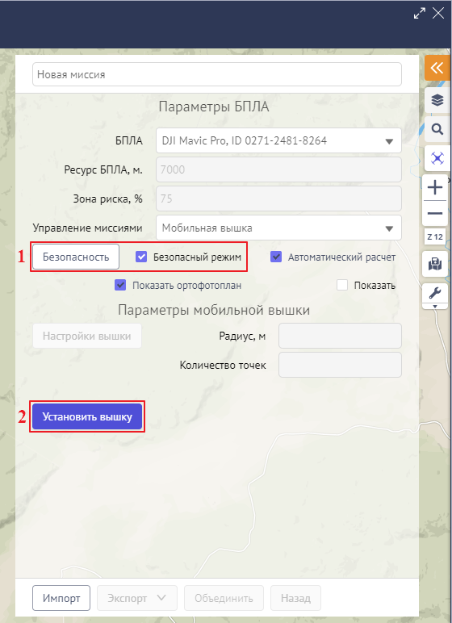
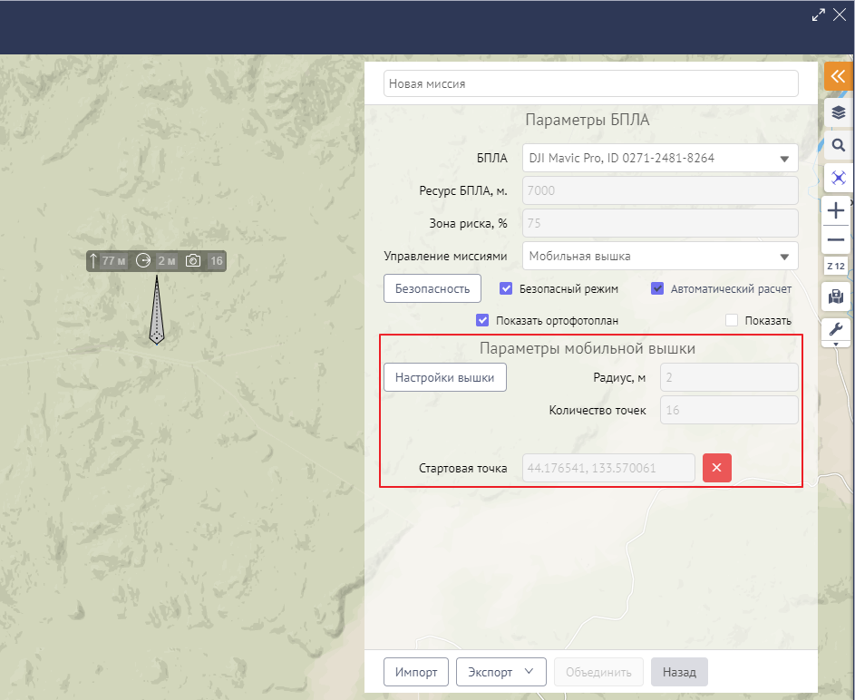
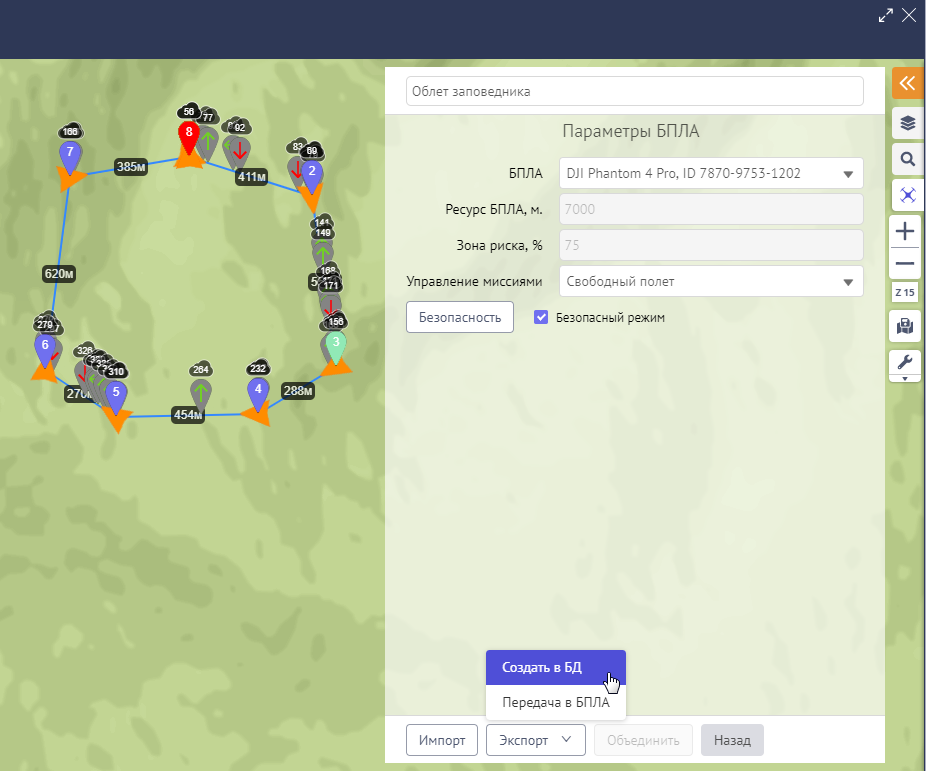
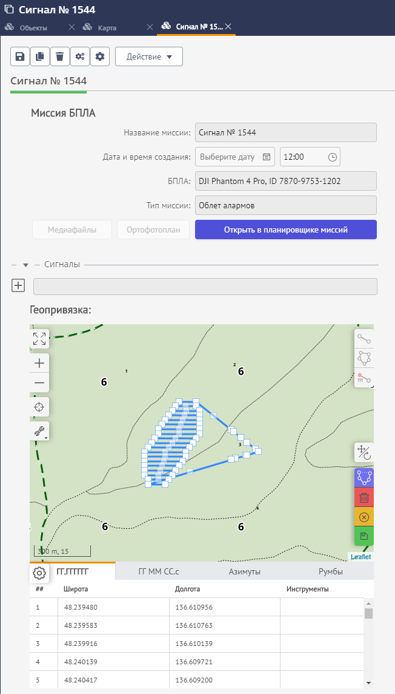

Назначение модуля
==================

Планировщик миссий БПЛА – это автономный модуль, который встраивается в программные продукты, разработанные на базе платформы автоматизации «CITORUS» (в частности – в систему «Кедр»). Модуль предназначен для формирования миссий беспилотных летательных аппаратов (далее – *БПЛА*) с целью их дальнейшей загрузки в БПЛА. Пользователями модуля являются выездные рейдовые группы управления лесами в Приморском крае.

В настоящее время модуль поддерживает формирование миссий для БПЛА следующих моделей:

- DJI Mavic Pro;
- DJI Phantom 4 Pro.

С помощью модуля формируются следующие типы миссий:

- **Облет территории** – при формировании миссии данного типа в автоматическом режиме выстраивается маршрут (далее – *грид*) и подбираются настройки облета территории, указанной пользователем, с целью создания ортофотоплана.
- **Облет алармов** – при формировании миссии данного типа в автоматическом режиме выстраивается грид и подбираются настройки облета территории, привязанной к сигналу о лесоизменении, с целью создания ортофотоплана.
- **Свободный полет** – при формировании миссии данного типа пользователь вручную указывает маршрут облета требуемой территории, настраивает параметры облета и, при необходимости, указывает последовательность действий БПЛА в каждой поворотной точке маршрута. При выполнении миссии данного типа создание ортофотоплана не предусмотрено.
- **Мобильная вышка** – при формировании миссии данного типа пользователь вручную указывает на карте точку взлета БПЛА и радиус окружности, для которой необходимо создать панорамную фотосъемку местности.

Визуальное представление миссий
===============================

При формировании миссии с помощью планировщика миссий БПЛА визуальное представление миссии отображается на карте (рис. 1).

В зависимости от выбранного типа миссии (см. раздел данного руководства `Типы миссий`_) маршрут полета выстраивается автоматически или вручную.

При формировании миссий типа **Облет алармов** и **Облет территории** основной задачей является получение ортофотоплана территории, привязанной к сигналу о лесоизменении или указанной пользователем. Маршрут миссий данных типов выстраивается автоматически и представляет собой грид – последовательность параллельных линий, при облете которых БПЛА фотографирует указанную местность с автоматически вычисленной периодичностью. После выполнения миссии на основе полученного фотоматериала создается ортофотоплан местности.

           Рисунок 1 – Визуальное представление миссии типа **Облет алармов**

При выполнении миссии типа **Свободный полет** маршрут облета требуемой территории выстраивается пользователем вручную (рис. 2). При выполнении миссии данного типа создание ортофотоплана не предусмотрено.
 

		   
           Рисунок 2 – Визуальное представление миссии типа **Свободный полет**
		   
Точки маршрута БПЛА соединяются линиями. В центре каждой линии указывается ее длина. Линии окрашиваются в следующие цвета (рис. 3):

- Синий – стандартная базовая линия, при пролете которой не возникает трудностей;
- Желтый – зона риска, участок пути, на котором у БПЛА расход заряда аккумулятора достигнет 75%;
- Красный – участок пути, при прохождении которого у БПЛА с высокой вероятностью полностью разрядится аккумулятор;
- Черный – участки пути, на которых велика вероятность столкновения с природными объектами. Линии черного цвета отображаются на карте, если в настройках безопасности полета отключен учет рельефа местности (см. раздел `Настройки безопасности полета БПЛА`_).

Белым цветом обозначается изгиб дуги, по которой БПЛА пролетает поворотную точку маршрута.
 

		   
	   Рисунок 3 – Цветовое обозначение линий маршрута
		   
Точки маршрута БПЛА
-------------------

Маршрут миссии БПЛА включает следующие ключевые точки: точку взлета (стартовую точку), поворотные точки маршрута и точку посадки (конечную точку).

Данные точки обозначаются на карте маркерами различных цветов (рис. 4):

1. Точка взлета – зеленый маркер;
2. Точка посадки – красный маркер;
3. Поворотные точки – синий маркер;
4. Выделенная точка – бирюзовый маркер.

Маркеры нумеруются в том порядке, в котором БПЛА будет пролетать их при выполнении миссии.

Над маркером указывается высота:

- для точки взлета – высота, которую БПЛА должен набрать в данной точке перед полетом;
- для промежуточных точек – высота, которую БПЛА должен набрать при достижении данной точки относительно точки взлета.

Под маркером с помощью оранжевой стрелки указывается направление, в котором будет расположена передняя (носовая) часть БПЛА при полете от данной точки к следующей точке маршрута.

		   
	   Рисунок 4 – Цветовое обозначение точек маршрута БПЛА
		   
Точки корректировки высот БПЛА
------------------------------

Если для построения миссии выбран безопасный режим и в настройках безопасности установлен флажок **Учет рельефа местности** (см. раздел данного руководства `Настройки безопасности полета БПЛА`_), то между нумерованными точками маршрута БПЛА автоматически устанавливаются точки корректировки высот (рис. 5), которые рассчитываются системой на основе данных рельефа местности.

Точки корректировки высот окрашиваются в серый цвет. На каждой точке с помощью пиктограммы обозначаются действия БПЛА по снижению/набору высоты:

- |image1| – при полете от данной точки к следующей точке БПЛА выполняет снижение до высоты, указанной над следующей точкой;
- |image2| – при полете от данной точки к следующей точке БПЛА выполняет набор высоты до значения, указанного над следующей точкой;
- |image3| – при полете от данной точки к следующей точке БПЛА летит на указанной высоте, не выполняя набора высоты или снижения.

		   
           Рисунок 5 – Точки корректировки высот
		   
При нажатии на какую-либо точку корректировки высоты на панели планировщика миссий БПЛА отображаются параметры данной точки (рис. 6):

- **Широта** точки.
- **Долгота** точки.
- **Высота**, на которой находится БПЛА в данной точке. Высота рассчитывается относительно начальной точки маршрута.
- **Изменение высоты** – действие БПЛА по снижению/набору высоты при перелете от данной точки к следующей точке. Обозначается с помощью пиктограмм, аналогичных расположенным на точках корректировки высот (см. выше).

Параметры точек набора высоты недоступны для редактирования вручную.

Чтобы скрыть параметры точки корректировки высоты, нажмите на карте на маркер точки взлета, посадки или любой поворотной точки маршрута.
 

		   
           Рисунок 6 – Параметры точки корректировки высоты

Запуск и начало работы с планировщиком миссий
=============================================

Чтобы создать миссию, в системе «Кедр», в меню быстрого доступа к функциональности нажмите на кнопку **Карта** (рис. 7).
 

		   
           Рисунок 7 – Меню быстрого доступа к функциональности
		   
В новой вкладке откроется карта мира (рис. 8).

Позиционируйте карту на предполагаемом участке облета. Затем на панели управления нажмите на кнопку |image4| **Планировщик миссий БПЛА** (рис. 8).
 

		   
           Рисунок 8 – Панель управления
		   
Откроется панель планировщика миссий (рис. 9), на которой следует заполнить следующие поля:

- **Название** – по умолчанию для миссии указано название «Новая миссия». Если миссию не требуется сохранять в БД (см. раздел `Сохранение миссии в БД`_), то заголовок по умолчанию можно не изменять. Если миссию требуется сохранить в БД, то для миссии следует указать уникальное (неповторяющееся) название.
- **БПЛА** – выберите из выпадающего списка модель аппарата, который будет совершать облет территории. При выборе модели в систему автоматически загружаются технические характеристики указанного БПЛА. Данные характеристики учитываются при построении миссии.
- **Ресурс БПЛА, м.** – в данном поле автоматически указывается максимально возможная протяженность маршрута модели, выбранной в поле **БПЛА**. Ресурс БПЛА учитывается при построении миссии. Поле недоступно для редактирования вручную.
- **Зона риска, %** – в данном поле автоматически указывается значение (в %) расхода заряда аккумулятора модели, выбранной в поле **БПЛА**, при достижении которого зона полета БПЛА объявляется зоной риска. Значение зоны риска учитывается при построении миссии. Поле недоступно для редактирования вручную.
- **Управление миссиями** – выберите тип создаваемой миссии:
     - **Облет алармов** – формирование в автоматическом режиме траектории облета сигналов о лесоизменениях, полученных посредством дешифрирования космосъемки, с целью получения ортофотоплана.
     - **Свободный полет** – построение маршрута облета требуемой территории вручную с возможностью назначения задач для аппарата на каждую поворотную точку маршрута.
     - **Облет территории** – формирование в автоматическом режиме траектории облета указанной территории с целью получения ортофотоплана.
     - **Мобильная вышка** – указание точки взлета и радиуса окружности территории с целью создания панорамной фотосъемки местности.
	 
Для дальнейшего формирования миссии выполните действия, описанные в соответствующем разделе данного руководства:

- `Облет алармов`_,
- `Свободный полет`_,
- `Облет территории`_,
- `Мобильная вышка`_.
 

		   
           Рисунок 9 – Панель управления миссией
		   
Настройка безопасности полета БПЛА
==================================

Для всех типов миссий (см. раздел данного руководства `Типы миссий`_) действуют настройки безопасности полета.

Чтобы включить/выключить безопасный режим полета БПЛА, на панели планировщика миссий установите/снимите флажок **Безопасный режим**, который расположен под полем **Управление миссиями** (пример представлен на рис. 10).

Чтобы перейти к настройке безопасного режима, нажмите на кнопку **Безопасность**.
 
.. figure:: _static/45.png
           :scale: 100 %
           :align: center
		   
           Рисунок 10 – Инструменты управления безопасностью полета БПЛА
		   
На панели планировщика миссий отобразятся следующие настройки безопасности полета БПЛА (рис. 11):

- **Учет ресурса БПЛА** – если флажок установлен, то при построении миссии учитывается ресурс выбранной модели БПЛА, и система не позволяет прокладывать маршрут, превышающий ресурс заряда аккумулятора. Если флажок снят, то построение такого маршрута допускается. При этом та часть маршрута, при прохождении которой у БПЛА полностью расходуется заряд аккумулятора, отмечается красной линией.

.. note:: Внимание! Ответственность за построение маршрута, во время которого у БПЛА до момента достижения конечной точки полностью разряжается аккумулятор, целиком и полностью возлагается на пользователя. 

- **Учет рельефа местности** – если флажок установлен, то при построении маршрута учитывается рельеф местности согласно настройкам ниже.
- **Учет погодных условий** – в настоящее время данная настройка не используется.
- **Источник данных о высотах** – в настоящее время доступен выбор только одного источника данных о высотах – цифровая модель высот Земли SRTM 1 Arc-Second Global.
- **Режим подъема/снижения**:
     - **Полет по кратчайшей траектории** – маршрут БПЛА рассчитывается с учетом только пиковых высот на маршруте.
     - **Полет на минимальной высоте** – маршрут БПЛА рассчитывается с учетом всех возвышенностей/впадин на пути, вследствие чего формируется траектория, плавно огибающая рельеф. При выборе данного режима получается более детальное изображение на фото- и видеосъемке местности.
- **Дельта значений игнорируемых углов подъема/снижения, град.** – настройка доступна, если в поле **Режим подъема/снижения** выбрано значение **Полет на минимальной высоте**. С помощью бегунка осуществляется указание дельты значений игнорируемых углов подъема/снижения БПЛА: при перемещении левого бегунка увеличивается значение игнорируемого угла снижения, при перемещении правого бегунка увеличивается значение игнорируемого угла подъема. Чем шире дельта, тем меньшее количество возвышенностей/впадин учитывается на пути БПЛА при расчете маршрута.
- **Высота древостоя, м** – средняя высота древостоя, которая учитывается в общей величине высоты для БПЛА в каждой точке. По умолчанию указана средняя высота древостоя в Приморском крае (40 м).
- **Погрешность, м** – базовая погрешность высоты над уровнем моря указанного **Источника данных о высотах**. Для SRTM, согласно нормативу, она равняется 16 м. Погрешность высоты над уровнем моря учитывается в общей величине высоты для БПЛА в каждой точке.

Из суммы значений, которые указаны в полях **Высота древостоя, м** и **Погрешность, м** рассчитывается базовая высота, которую БПЛА набирает в точке взлета (стартовой точке). Если в полях указаны значения по умолчанию, то высота в точке старта всегда равняется 56 м. Высота в поворотных точках маршрута рассчитывается из суммы значений базовой высоты и высоты над уровнем моря по данным **Источника данных о высотах**.

Чтобы сохранить настройки безопасности, в нижней части панели планировщика миссий нажмите на кнопку **Применить**.
 
Чтобы вернуться к настройкам миссии БПЛА, нажмите на кнопку **Назад**.
 

		   
           Рисунок 11 – Настройки безопасности

Типы миссий
===========

Облет алармов
-------------

Тип миссии **Облет алармов** предназначен для формирования в автоматическом режиме траектории облета сигналов о лесоизменениях, полученных посредством дешифрирования космосъемки, с целью получения ортофотоплана. Сигналы о лесоизменениях – это векторные точки, которые наглядно показывают, в каком месте произошли изменения лесного массива в силу человеческого фактора: вырубка леса или незаконная свалка мусора. Данные точки обозначаются на карте иконкой |image5|.

Чтобы сформировать для БПЛА миссию типа **Облет алармов**, предварительно выполните шаги, которые описаны в разделе данного руководства `Запуск и начало работы с планировщиком миссий`_.

Чтобы включить безопасный режим построения миссии, установите флажок **Безопасный режим** (рис. 12, цифра 1).

Если требуется изменить настройки безопасного режима, нажмите на кнопку **Безопасность** и отредактируйте настройки так, как это описано в разделе данного руководства `Настройки безопасности полета БПЛА`_).
 

		   
           Рисунок 12 – Создание миссии типа **Облет алармов**

Формирование маршрута миссии «Облет алармов»
^^^^^^^^^^^^^^^^^^^^^^^^^^^^^^^^^^^^^^^^^^^^

Позиционируйте карту на точке сигнала о лесоизменении (рис. 12, цифра 2).

Чтобы отметить на карте точку взлета БПЛА, на панели планировщика миссий нажмите на кнопку **Добавить точку старта** (рис. 12, цифра 3) и установите точку на карте щелчком левой клавиши мыши.

Если для построения миссии выбран безопасный режим, то на экране отобразится диалоговое окно, представленное на рисунке 13. Нажмите в данном окне на кнопку **ОК**.
 

		   
           Рисунок 13 – Диалоговое окно
		   
На карте отобразятся (рис. 14):

- Маркер стартовой точки. Координаты стартовой точки рассчитываются системой автоматически и отображаются в поле **Стартовая точка** (рис. 14, цифра 1). Значение в данном поле недоступно для редактирования вручную. При необходимости стартовую точку можно удалить. Для этого нажмите на кнопку |image6|, которая расположена справа от поля **Стартовая точка**. При удалении стартовой точки удаляются зоны доступности БПЛА (см. ниже). Для построения миссии стартовую точку нужно установить повторно.
- Окружность зоны доступности – окружность, в пределах которой (ориентировочно) возможно построение миссии согласно ресурсу БПЛА. Радиус данной окружности обозначен зеленой двунаправленной стрелкой.
- Окружность зоны риска – окружность, при достижении границы которой расход заряда аккумулятора БПЛА достигает 75%. Радиус данной окружности обозначен красной двунаправленной стрелкой. Если для построения миссии выбран безопасный режим, то построение маршрута облета территории в зоне, которая выходит за пределы зоны доступности, запрещено.

Чтобы обозначить сигнал о лесоизменении, который необходимо исследовать в процессе выполнения миссии, на панели планировщика миссий нажмите на кнопку **Добавить аларм** (рис. 14, цифра 2) и щелкните левой клавишей мыши по точке сигнала на карте.
 

		   
           Рисунок 14 – Установка стартовой точки БПЛА
		   
Системой автоматически рассчитается грид облета территории, которая привязана к указанному сигналу (рис. 15). Конечная точка маршрута БПЛА при этом автоматически устанавливается в стартовой точке.
 

		   
           Рисунок 15 – Грид облета
		   
На панели планировщика миссий отобразится группа полей, описывающих территорию облета указанного сигнала (рис. 15, цифра 1). В данных полях (слева направо) содержится следующая информация:

- Номер и дата создания сигнала о лесоизменении.
- Тип полета:
     - **Исследование** – для БПЛА рассчитывается грид облета (рис. 15);
     - **Пролет** – БПЛА летит напрямую к точке сигнала о лесоизменении и обратно (рис. 16).
- Расстояние от стартовой точки до точки сигнала о лесоизменении. 

При необходимости с помощью кнопки |image6|, расположенной справа от группы полей, можно удалить созданную траекторию пролета/исследования сигнала о лесоизменении.
 
.. figure:: _static/44.png
           :scale: 100 %
           :align: center
		   
           Рисунок 16 – Траектория пролета
		   
При выполнении одной миссии допустимо исследование нескольких сигналов о лесоизменениях, если для облета территорий данных сигналов достаточно заряда аккумулятора БПЛА.

Чтобы отметить на карте второй сигнал о лесоизменении, который необходимо исследовать в рамках выполнения миссии, на панели планировщика миссий нажмите на кнопку **Добавить аларм** (рис. 17) и щелкните по требуемому сигналу на карте левой клавишей мыши.
 

		   
           Рисунок 17 – Добавление в миссию второго сигнала
		   
Система автоматически рассчитает траекторию полета БПЛА от территории первого сигнала к территории второго сигнала и грид облета для территории второго сигнала (рис. 18).
 

		   
           Рисунок 18 – Грид облета двух сигналов
		   
Редактирование полигона миссии «Облет алармов»
^^^^^^^^^^^^^^^^^^^^^^^^^^^^^^^^^^^^^^^^^^^^

Редактирование полигона облета аларма осуществляется аналогично редактированию полигона облета территории (см. раздел данного руководства `Редактирование полигона миссии «Облет территории»`_).

Настройки миссии «Облет аларма»
^^^^^^^^^^^^^^^^^^^^^^^^^^^^^^^

Настройки миссии «Облет алармов» аналогичны настройкам миссии «Облет территории» (см. раздел данного руководства `Настройки миссии «Облет территории»`_).

Свободный полет
---------------

При формировании миссии типа **Свободный полет** вручную указывается маршрут облета требуемой территории, настраиваются параметры облета и, при необходимости, указывается последовательность действий БПЛА в каждой поворотной точке маршрута. При выполнении миссии данного типа создание ортофотоплана не предусмотрено.

Чтобы сформировать миссию типа **Свободный полет**, предварительно выполните шаги, которые описаны в разделе данного руководства `Запуск и начало работы с планировщиком миссий`_.

Чтобы включить безопасный режим построения миссии, установите флажок **Безопасный режим** (рис. 19, цифра 1).

Если требуется изменить настройки безопасного режима, нажмите на кнопку **Безопасность** и отредактируйте настройки так, как это описано в разделе данного руководства `Настройки безопасности полета БПЛА`_.

Нажмите на кнопку **Перейти** (рис. 19, цифра 2).
 

		   
           Рисунок 19 – Создание миссии типа **Свободный полет**
		   
Установите начальную точку маршрута БПЛА (далее – *точка взлета*). Для этого щелкните по требуемой точке на карте ***правой*** клавишей мыши.

Если для построения миссии выбран безопасный режим, то на экране отобразится диалоговое окно, представленное на рисунке 20. Нажмите в данном окне на кнопку **ОК**.
 

		   
           Рисунок 20 – Диалоговое окно

Установленная точка отобразится на карте (рис. 21).
 

		   
           Рисунок 21 – Начальная точка маршрута
		   
На панели планировщика миссий отобразятся настройки для данной точки:

- **Широта** и **Долгота** указанной точки – рассчитываются автоматически при установке точки на карте. При необходимости местоположение точки можно изменить следующими способами:
     - Переместить точку на карте, удерживая ее левой клавишей мыши. При этом **Широта** и **Долгота** нового местоположения точки будут рассчитаны автоматически.
     - Редактировать значения в полях **Широта** и/или **Долгота**. Для этого следует полностью/частично удалить значение широты/долготы и указать требуемое значение вручную или уменьшить/увеличить значение широты/долготы с помощью кнопок переключателя (рис. 22). Кнопки переключателя отображаются при наведении курсора мыши на поле **Широта**/**Долгота**. При изменении широты и долготы установленная точка автоматически перемещается на карте в указанную координату.
 

		   
           Рисунок 22 – Переключатель
		   
- **Высота** – для точки взлета в данном поле указывается базовая высота, которую БПЛА должен набрать перед полетом. Для поворотной точки в данном поле указывается высота относительно точки взлета, которую БПЛА должен набрать при достижении данной точки. Если для построения миссии выбран безопасный режим, то значение высоты для каждой точки маршрута рассчитывается автоматически (см. раздел `Настройки безопасности полета БПЛА`_) и недоступно для редактирования вручную.
- **Скорость** – скорость полета БПЛА из данной точки в следующую точку маршрута.
- **Изгиб** – изгиб дуги, по которой БПЛА пролетает данную точку. Значение по умолчанию – 0. Если БПЛА не требуется останавливать в данной точке маршрута, то в целях экономии заряда аккумулятора изгиб дуги рекомендуется увеличить. Дуга полета БПЛА обозначается на карте линией белого цвета (рис. 23). При выборе точки взлета или посадки данное поле блокируется.
 
.. figure:: _static/16.png
           :scale: 100 %
           :align: center
		   
           Рисунок 23 – Изгиб дуги полета БПЛА

- **Направление** – направление (в градусах), в котором требуется расположить переднюю (носовую) часть БПЛА при полете от данной точки к следующей точке маршрута. Направление носовой части указывается на карте с помощью оранжевой стрелки, расположенной под маркером точки маршрута.

По умолчанию для БПЛА при нахождении в точке маршрута назначено выполнение одного действия – наклон камеры на -90º.

Чтобы редактировать действие, разверните выпадающий список (рис. 24) и выберите действие, которое БПЛА следует выполнить в данной точке:

- **Остановиться на** – остановиться в данной точке на указанное количество секунд. Интервал остановки указывается в поле справа вручную или с помощью кнопок переключателя, которые отображаются при наведении курсора мыши на поле. Действие **Остановиться на** целесообразно применять в совокупности с другими действиями БПЛА, например, **Начать запись** и **Остановить запись**.
- **Сфотографировать** – сделать фотографию.
- **Начать запись** – начать видеозапись.
- **Остановить запись** – остановить видеозапись.
- **Развернуть аппарат** – развернуть аппарат в данной точке на указанное количество градусов. Градусы вводятся в поле справа вручную или с помощью кнопок переключателя, которые отображаются при наведении курсора мыши на поле.
- **Наклонить камеру** – наклонить камеру на указанное количество градусов вниз от оси. Градусы вводятся в поле справа вручную или с помощью кнопок переключателя, которые отображаются при наведении курсора мыши на поле.
 

		   
           Рисунок 24 – Список действий БПЛА
		   
Чтобы назначить БПЛА выполнение еще одного действия, нажмите на кнопку **Добавить действие** (рис. 25).
 

		   
           Рисунок 25 – Кнопка **Добавить действие**
		   
Ниже отобразится аналогичная группа полей (рис. 26).
 

		   
           Рисунок 26 – Группа полей для назначения второго действия

При нахождении в одной точке БПЛА может выполнить в сумме до 15 действий. Пример назначения последовательного выполнения действий представлен на рисунке 27.

Если какое-либо действие требуется удалить, нажмите на кнопку |image6|, которая расположена справа от группы полей данного действия.
 

		   
           Рисунок 27 – Последовательность действий БПЛА
		   
Добавьте и настройте другие точки маршрута типа **Свободный полет** аналогичным образом.

При необходимости между любыми точками маршрута БПЛА можно установить промежуточную точку. Для этого на карте следует выделить точку, ***перед которой*** необходимо установить промежуточную точку (рис. 28, цифра 1), и на панели планировщика миссий нажать на кнопку **Добавить** (рис. 28, цифра 2).
 

		   
           Рисунок 28 – Добавление промежуточной точки маршрута

Между выбранной точкой и предшествующей точкой будет установлена промежуточная точка маршрута БПЛА (рис. 29).
 

		   
           Рисунок 29 – Промежуточная точка маршрута
		   
При необходимости любую точку маршрута БПЛА можно удалить. Для этого необходимо выделить требуемую точку на карте (рис. 30, цифра 1) и на панели планировщика миссий нажать на кнопку **Удалить** (рис. 30, цифра 2).
 

		   
           Рисунок 30 – Удаление точки маршрута
		   
Указанная точка будет удалена (рис. 31).
 

		   
           Рисунок 31 – Точка маршрута удалена
		   
Переход между настройками точек маршрута осуществляется с помощью кнопок |image7| и |image8|, которые расположены в нижней части панели планировщика миссий (рис. 32).

Кнопка **Назад** предназначена для перехода к основным настройкам полета, которые описаны в разделе данного руководства `Создание миссии`_.
 

		   
           Рисунок 32 – Командные кнопки

Облет территории
----------------

При формировании миссии типа **Облет территории** в автоматическом режиме выстраивается грид и подбираются настройки облета территории, указанной пользователем, с целью создания ортофотоплана.

Чтобы сформировать миссию типа **Облет территории**, предварительно выполните шаги, которые описаны в разделе данного руководства `Запуск и начало работы с планировщиком миссий`_.

Чтобы включить безопасный режим построения миссии, установите флажок **Безопасный режим** (рис. 33, цифра 1).

Если требуется изменить настройки безопасного режима, нажмите на кнопку **Безопасность** и отредактируйте настройки так, как это описано в разделе данного руководства `Настройки безопасности полета БПЛА`_.

.. figure:: _static/27.png
           :scale: 100 %
           :align: center
		   
           Рисунок 33 – Создание миссии типа **Облет территории**
		   
Формирование маршрута миссии «Облет территории»
^^^^^^^^^^^^^^^^^^^^^^^^^^^^^^^^^^^^^^^^^^^^^^^

Чтобы отметить на карте точку взлета БПЛА, на панели планировщика миссий нажмите на кнопку **Добавить точку старта** (рис. 33, цифра 2) и установите точку на карте щелчком левой клавиши мыши.

Если для построения миссии выбран безопасный режим, то на экране отобразится диалоговое окно, представленное на рисунке 34. Нажмите в данном окне на кнопку **ОК**.
 

		   
           Рисунок 34 – Диалоговое окно
		   
На карте отобразятся (рис. 35):

- Маркер стартовой точки. Координаты стартовой точки рассчитываются системой автоматически и отображаются в поле **Стартовая точка** (рис. 35, цифра 1). Значение в данном поле недоступно для редактирования вручную. При необходимости стартовую точку можно удалить. Для этого нажмите на кнопку |image6|, которая расположена справа от поля **Стартовая точка**. При удалении стартовой точки удаляются зоны доступности БПЛА (см. ниже). Для построения миссии стартовую точку нужно установить повторно.
- Окружность зоны доступности – окружность, в пределах которой (ориентировочно) возможно построение миссии согласно ресурсу БПЛА. Радиус данной окружности обозначен зеленой двунаправленной стрелкой.
- Окружность зоны риска – окружность, при достижении границы которой расход заряда аккумулятора БПЛА достигает 75%. Радиус данной окружности обозначен красной двунаправленной стрелкой. Если для построения миссии выбран безопасный режим, то построение маршрута облета территории в зоне, которая выходит за пределы зоны доступности, запрещено.
 
.. figure:: _static/28.png
           :scale: 100 %
           :align: center
		   
           Рисунок 35 – Установка стартовой точки БПЛА
		   
В зоне доступности БПЛА нарисуйте полигон территории облета. Для этого на панели планировщика миссий БПЛА нажмите на кнопку **Добавить территорию** (рис. 35, цифра 2). Затем последовательными щелчками левой клавиши мыши по карте обозначьте крайние точки территории облета (рис. 36).

Если полигон требуется удалить до окончания его отрисовки, на панели планировщика миссий нажмите на кнопку **Отменить ввод территории**.

Если территория полигона отрисована верно, замкните фигуру полигона. Для этого установите последнюю точку территории облета щелчком левой клавиши мыши по первой точке полигона.
 

		   
           Рисунок 36 – Добавление территории облета
		   
Для отрисованного полигона автоматически рассчитается грид облета (рис. 37). Конечная точка маршрута БПЛА при этом автоматически устанавливается в стартовой точке.

На панели планировщика миссий отобразится группа полей, описывающих отрисованный полигон (рис. 37, цифра 1):

- В поле слева отобразится номер полигона. Полигоны нумеруются в порядке их отрисовки на карте.
- В поле справа отобразится расстояние от стартовой до первой поворотной точки маршрута.

При необходимости с помощью кнопки |image6|, расположенной справа от группы полей, можно удалить созданный полигон.
 

		   
           Рисунок 37 – Грид облета
		   
Для одной миссии БПЛА можно указать несколько полигонов облета. Чтобы добавить дополнительный полигон, на панели планировщика миссий нажмите на кнопку **Добавить территорию** (рис. 37, цифра 2) и отрисуйте второй полигон облета аналогично первому (рис. 38).
 

		   
           Рисунок 38 – Отрисовка второго полигона облета
		   
Система автоматически рассчитает траекторию полета БПЛА от первого полигона ко второму и грид облета для второго полигона (рис. 39).
 

		   
           Рисунок 39 – Грид облета двух полигонов
		   
Если полигоны облета пересекаются (рис. 40), то их можно объединить в один полигон, чтобы БПЛА не облетал одни и те же участки территории дважды. Для объединения полигонов на панели планировщика миссий нажмите на кнопку **Объединить**.
 

		   
           Рисунок 40 – Объединение полигонов
		   
Полигоны объединятся в один полигон, и для него рассчитается единый грид облета (рис. 41).
 

		   
           Рисунок 41 – Полигоны объединены
		   
Редактирование полигона миссии «Облет территории»
^^^^^^^^^^^^^^^^^^^^^^^^^^^^^^^^^^^^^^^^^^^^^^^

При необходимости полигон можно редактировать: переместить, повернуть, масштабировать или изменить положение его крайних/промежуточных точек. При редактировании фигуры полигона система автоматически выполняет пересчет маршрута полета БПЛА.

Для перехода в режим редактирования выделите полигон двойным щелчком левой клавиши мыши.

На карте отобразится фигура (квадрат или прямоугольник), в которую будет вписан данный полигон (рис. 42).
 

		   
           Рисунок 42 – Режим редактирования полигона

Чтобы переместить полигон в другое местоположение, наведите на него курсор мыши так, чтобы курсор принял вид перекрестья (рис. 43). Затем перетащите полигон, удерживая левую клавишу мыши.
 

		   
           Рисунок 43 – Перемещение полигона
		   
Чтобы повернуть фигуру полигона, наведите курсор мыши на точку, которая расположена над полигоном так, чтобы курсор принял вид перекрестья (рис. 44). После этого перемещайте точку, удерживая левую клавишу мыши до тех пор, пока фигура не развернется под требуемым углом.
 

		   
           Рисунок 44 – Поворот фигуры полигона

Чтобы пропорционально увеличить/уменьшить масштаб фигуры полигона, наведите курсор мыши на крайнюю точку фигуры, в которую он вписан. После того как курсор примет вид двунаправленной стрелки, перетащите точку, удерживая левую клавишу мыши:

- по направлению от центра полигона, чтобы увеличить масштаб полигона;
- по направлению к центру полигона, чтобы уменьшить масштаб полигона.
 

		   
           Рисунок 45 – Увеличение/уменьшение масштаба фигуры полигона
		   
Чтобы переместить крайнюю/промежуточную точку полигона, наведите курсор мыши непосредственно на данную точку и переместите ее, удерживая левую клавишу мыши (рис. 46). Крайние точки полигона – это точки, которые устанавливаются пользователем при создании полигона. Данные точки обозначены маркерами белого цвета. Промежуточные точки – это вспомогательные точки корректировки фигуры. Данные точки обозначены маркерами голубого цвета.
 

		   
           Рисунок 46 – Перемещение крайней точки полигона
		   
Чтобы выйти из режима редактирования полигона, повторно выделите его двойным щелчком левой клавиши мыши.

Настройки миссии «Облет территории»
^^^^^^^^^^^^^^^^^^^^^^^^^^^^^^^^^^^

После формирования маршрута БПЛА на панели планировщика миссий становятся доступны настройки миссии БПЛА (рис. 47).
 

		   
           Рисунок 47 – Настройки миссии
		   
Флаговая кнопка **Показать** (рис. 48) предназначена для отображения/скрытия точек смены вектора движения БПЛА: поворотных точек маршрута и точек корректировки высот (описание данных точек см. в разделе данного руководства `Визуальное представление миссий`_).

Если флажок **Показать** установлен, то траектория полета БПЛА имеет вид, представленный на рисунке 48.
 

		   
           Рисунок 48 – Флажок **Показать** установлен
		   
Если флажок **Показать** снят, то траектория полета БПЛА имеет вид, представленный на рисунке 49.
 

		   
           Рисунок 49 – Флажок **Показать** снят

Флаговая кнопка **Автоматический расчет** (рис. 50) предназначена для включения/отключения автоматического расчета параметров полета БПЛА. Если данный флажок установлен, то для всех поворотных точек маршрута автоматически рассчитываются и устанавливаются единые параметры: скорость, высота, изгиб дуги пролета, направление носовой части БПЛА. Благодаря этому после выполнения миссии ортофотоплан местности «сшивается» корректно. В данном режиме недоступно редактирование параметров каждой поворотной точки маршрута вручную, но доступно редактирование **Настроек облета** территории в целом (см. ниже).
 

		   
           Рисунок 50 – Флажок **Автоматический расчет** установлен
		   
Если флажок **Автоматический расчет** снят (рис. 51), то:

- Допускается редактирование каждой поворотной точки маршрута вручную. Для перехода к настройкам какой-либо поворотной точки следует выделить ее на карте (рис 51, цифра 1) и на панели планировщика миссий нажать на кнопку **Назад** (рис 51, цифра 2). Настройка параметров поворотной точки осуществляется аналогично настройке параметров поворотных точек миссии типа **Свободный полет** (см. раздел данного руководства `Свободный полет`_).
- Запрещается редактирование **Настроек облета** территории в целом (см. ниже).
- Автоматически снимается флажок и блокируется флаговая кнопка **Показать ортофотоплан** (см. ниже), так как при настройке параметров поворотных точек маршрута вручную нет гарантии, что по итогам выполнения миссии ортофотоплан будет создан корректно.
 

		   
           Рисунок 51 – Флажок **Автоматический расчет** снят
		   
Флаговая кнопка **Показать ортофотоплан** (рис. 52) предназначена для отображения/скрытия ориентировочных границ фотографий при съемке в надир с параметрами, указанными в **Настройках облета** (см. ниже). Флаговая кнопка **Показать ортофотоплан** доступна, если установлен флажок **Автоматический расчет**.

Если флажок **Показать ортофотоплан** установлен, то территория, для которой будет создан ортофотоплан, выделяется на карте зеленым цветом.
 

		   
           Рисунок 52 – Флажок **Показать ортофотоплан** установлен

Если флажок **Показать ортофотоплан** снят, то границы ортофотоплана на карте не отображаются (рис. 53).
 

		   
           Рисунок 53 – Флажок **Показать ортофотоплан** снят

Данные в полях **Скорость БПЛА** и **Частота кадров** (рис. 54) вычисляются автоматически на основе **Настроек облета** (см. ниже). Эти значения перед выполнением миссии необходимо указать вручную в настройках БПЛА для того, чтобы получить полное перекрытие ортофотопланом указанной территории.
 

		   
           Рисунок 54 – Настройки облета

Для перехода к настройкам облета территории нажмите на кнопку **Настройки облета**.

Откроется страница, представленная на рисунке 55. На данной странице расположены:

1. Группа полей, описывающих технические характеристики БПЛА. Данные параметры являются неизменными и недоступны для редактирования вручную.
2. Группа полей, которая предназначена для настройки параметров облета территории:
- **Ориентация БПЛА** – направление, в котором будет расположена передняя (носовая) часть БПЛА при полете от данной точки к следующей точке маршрута:
     - **На север** – носовая часть БПЛА всегда направлена на север;
     - **По траектории** – на крайних точках «длинных» отрезков грида носовая часть БПЛА сориентирована одинаково, по направлению движения, далее меняет ориентацию на коротких участках;
     - **На следующую точку** – носовая часть БПЛА автоматически поворачивается в направлении следующей поворотной точки.
- **Высота** (метров) – высота полета БПЛА при выполнении миссии.
- **Скорость** (км/ч) – скорость полета БПЛА при выполнении миссии.
- **Размер пикселя в поле** (метров) – соответствие пикселя, полученного на снимке, реальной величине на поверхности земли.
- **Фронтальное перекрытие** (процентов) – перекрытие снимков по прямой линии движения БПЛА.
- **Боковое перекрытие** (процентов) – перекрытие снимка прямой со снимком левого и правого трека.
- **Ширина полосы обзора** (метров) – охват камеры БПЛА.
- **Расстояние между треками** (метров) – расстояние между параллельными треками одного маршрута.
- **Частота кадров** (сек) – частота фотографирования местности для изготовления корректного ортофотоплана. Вычисляется автоматически на основе **Настроек облета**, указанных выше.
3.	Командные кнопки:
- **Применить** – пересчитать грид облета в соответствии с указанными данными;
- **Назад** – вернуться к настройкам миссии БПЛА.
 

		   
           Рисунок 55 – Настройки облета
		   
Если на панели планировщика миссий снят флажок **Автоматический расчет** (см. выше), то при попытке сохранить **Настройки облета** отображается диалоговое окно, представленное на рисунке 56.

Если в процессе дальнейшей работы с миссией флажок **Автоматический расчет** устанавливается, то система автоматически пересчитывает параметры миссии в соответствии с указанными **Настройками облета**.
 

		   
           Рисунок 56 – Диалоговое окно

Мобильная вышка
===============

При формировании миссии типа **Мобильная вышка** вручную указывается точка взлета БПЛА и радиус окружности территории, для которой необходимо создать панорамную фотосъемку местности.

Чтобы сформировать миссию типа **Мобильная вышка**, предварительно выполните шаги, которые описаны в разделе данного руководства `Запуск и начало работы с планировщиком миссий`_.

Чтобы включить безопасный режим построения миссии, установите флажок **Безопасный режим** (рис. 57, цифра 1).

Если требуется изменить настройки безопасного режима, нажмите на кнопку **Безопасность** и отредактируйте настройки так, как это описано в разделе данного руководства `Настройки безопасности полета БПЛА`_.

Чтобы указать точку взлета БПЛА, на панели планировщика миссий нажмите на кнопку **Установить вышку** (рис. 57, цифра 2) и щелчком левой клавиши мыши укажите требуемую точку на карте.
 

		   
           Рисунок 57 – Кнопка **Установить вышку**

В указанной точке отобразится маркер мобильной вышки (рис. 58). Над маркером указываются следующие параметры (слева направо):

- Высота, на которую поднимается БПЛА в указанной точке.
- Радиус окружности, по которой БПЛА выполняет облет территории. По умолчанию устанавливается радиус 2 м. Данное значение также отображается на панели планировщика миссий БПЛА, в поле **Радиус, м**. При необходимости это значение можно изменить на странице **Настройки вышки** (см. ниже).
- Количество фотоснимков, которое делает БПЛА во время полета. Данное значение также отображается на панели планировщика миссий БПЛА, в поле **Количество точек**. Значение рассчитывается системой автоматически исходя из указанных **Настроек вышки** (см. ниже).
 

		   
           Рисунок 58 – Мобильная вышка

Координаты указанной точки взлета БПЛА отображаются на панели планировщика миссий, в поле **Стартовая точка**. При необходимости стартовую точку можно удалить. Для этого нажмите на кнопку |image6|, расположенную слева от поля координат.

Чтобы перейти к настройкам миссии, на панели планировщика миссий нажмите на кнопку **Настройки вышки**.

Откроется страница, представленная на рисунке 59. На данной странице расположены:

1. Группа полей, описывающих технические характеристики БПЛА. Данные параметры являются неизменными и недоступны для редактирования вручную.
2. Группа полей, которая предназначена для настройки параметров мобильной вышки:
- **Радиус** – радиус окружности, по которой БПЛА выполняет облет территории.
- **Количество точек съемки** – количество фотоснимков, которое делает БПЛА во время полета.
- **Угол наклона** – угол наклона камеры БПЛА.
- **Высота** – высота, которую БПЛА набирает перед полетом в стартовой точке.
- **Основание (ширина полосы обзора)** – в настоящее время не используется.
- **Перекрытие** – в настоящее время не используется.
3.	Командные кнопки:
- **Применить** – пересчитать грид облета в соответствии с указанными данными;
- **Назад** – вернуться к настройкам миссии БПЛА.
 

		   
           Рисунок 59 – Настройки мобильной вышки

Экспорт миссии
==============

Созданную миссию можно сохранить следующими способами:

- Однократно сохранить миссию в файл формата CSV для ее дальнейшей загрузки в БПЛА. В этом случае после сброса настроек в системе «Кедр» миссия будет удалена.
- Сохранить миссию в базу данных. Сохраненную миссию можно редактировать и многократно выгружать в файлы формата CSV для дальнейшей загрузки в БПЛА.

Сохранение миссии в БД
----------------------

Чтобы сохранить миссию в БД, на панели планировщика миссий наведите курсор мыши на кнопку **Экспорт** и в выпадающем списке выберите пункт **Создать в БД** (рис. 61).
 

		   
           Рисунок 60 – Команда **Создать в БД**
		   
В новой вкладке системы откроется страница создания нового объекта в БД (рис. 61).
 

		   
           Рисунок 61 – Страница создания объекта в БД
		   
Данная страница содержит следующие блоки настроек:

1. Панель инструментов – подробное описание панели инструментов см. в разделе Управление объектами в режиме редактирования руководства Платформа автоматизации «CITORUS».
2. Поля описания объекта (значения в данных полях являются нередактируемыми):
- **Название миссии**, указанное при создании миссии на панели планировщика миссий БПЛА.
- **Дата и время создания** объекта.
- **БПЛА** – модель аппарата, указанная при создании миссии на панели планировщика миссий БПЛА.
- **Тип миссии**, указанный при создании миссии на панели планировщика миссий БПЛА.
3. Командная кнопка **Открыть в планировщике миссий** – при нажатии на данную кнопку открывается вкладка **Карта** и во вкладке разворачивается панель планировщика миссий БПЛА. При этом на карте воспроизводится визуальное представление миссии, которую описывает данный объект, а на панели планировщика миссий отображаются настройки данной миссии.
4. **Геопривязка** – универсальная геокатегория объекта. Содержит географические координаты объекта, визуально представляет его на карте и обеспечивает возможность его редактирования. Подробное описание универсальной геокатегории см. в разделе Управление геокодированными объектами. Универсальная геокатегория руководства Платформа автоматизации «CITORUS».

Чтобы сохранить миссию в БД, на панели инструментов нажмите на кнопку |image9| **Сохранить**. Миссия сохранится в дереве объектов.

Восстановление миссии из БД
---------------------------

Чтобы восстановить миссию из БД, во вкладке **Объекты** (рис. 62) выполните поиск объекта, который описывает данную миссию. Порядок действий по поиску объектов в БД подробно описан в разделе Поиск объектов системы руководства Платформа автоматизации «CITORUS».

Откройте требуемый объект щелчком левой клавиши мыши.
 

		   
           Рисунок 62 – Вкладка **Объекты**

Откроется страница редактирования объекта (рис. 63).

При необходимости редактируйте геоописание объекта так, как описано в разделе Управление геокодированными объектами. Универсальная геокатегория руководства Платформа автоматизации «CITORUS».

Сохраните изменения нажатием на кнопку |image9| **Сохранить**, которая расположена на панели инструментов.

Затем нажмите на кнопку **Открыть в планировщике миссий**.
 

		   
           Рисунок 63 – Страница редактирования объекта

В новой вкладке откроется карта, на которой отобразится визуальное представление восстановленной миссии, и развернется панель планировщика миссий БПЛА, на которой отобразятся настройки данной миссии.

При необходимости выполните экспорт миссии в CSV-файл для ее дальнейшей загрузки в БПЛА так, как это описано в разделе данного руководства `Передача в БПЛА`_.

Передача в БПЛА
---------------

Для загрузки миссии в БПЛА необходимо:

1. Сохранить файл миссии на ПК.
2. Загрузить данный файл в БПЛА с помощью веб-приложения Litchi.

Чтобы сохранить файл миссии, на панели планировщика миссий наведите курсор мыши на кнопку **Экспорт** и в выпадающем списке выберите пункт **Передача в БПЛА** (рис. 64).
 

		   
           Рисунок 64 – Команда **Передача в БПЛА**

В папку, указанную в настройках браузера для загрузки файлов из сети Интернет, сохранится файл **flight_mission.csv**. Данный файл содержит конфигурацию созданной миссии. Загрузите этот файл в БПЛА с помощью веб-приложения Litchi. Загрузка осуществляется в соответствии с документацией производителя веб-приложения.

Импорт миссии
=============

Миссию, которая была сохранена в файл формата CSV, можно импортировать в систему, например, для того, чтобы редактировать настройки миссии и/или сохранить ее в БД.

Чтобы импортировать миссию, разверните панель планировщика миссий нажатием на кнопку |image1| **Планировщик миссий БПЛА** (рис. 65, цифра 1).

В нижней части панели нажмите на кнопку **Импорт** (рис. 65, цифра 2).
 

		   
           Рисунок 65 – Панель управления миссией

С помощью проводника Windows укажите CSV-файл, который описывает конфигурацию требуемой миссии.

Миссия загрузится в систему: на карте отобразится маршрут миссии, а на панели управления – настройки загруженной миссии (рис. 66).

Дальнейшая работа с миссией осуществляется по стандартному сценарию.
 

		   
           Рисунок 66 – Импортированная миссия

Удаление миссии
===============

Если требуется полностью удалить конфигурацию созданной миссии, сверните панель планировщика миссий нажатием на кнопку |image1| **Планировщик миссий БПЛА** (рис. 67).

Панель планировщика свернется, и все настройки управления миссией будут удалены.
 

		   
           Рисунок 67 – Кнопка **Планировщик миссий БПЛА**

При повторном нажатии на кнопку панель планировщика миссий отобразится с настройками по умолчанию (рис. 66).
 

		   
           Рисунок 68 – Настройки по умолчанию

Журнал изменений
================

+-----------+--------------+----------------------------------------+
| Версия    | Дата         | Исправления                            |
+===========+==============+========================================+
| v.1.000   | 24.06.2019   | Размещение исходной версии документа   |
+-----------+--------------+----------------------------------------+

.. |image1| image:: https://github.com/citoruspm/bpla/blob/master/source/_static/button_11.png?raw=true
.. |image2| image:: https://github.com/citoruspm/bpla/blob/master/source/_static/button_9.png?raw=true
.. |image3| image:: https://github.com/citoruspm/bpla/blob/master/source/_static/button_10.png?raw=true
.. |image4| image:: https://github.com/citoruspm/bpla/blob/master/source/_static/button_1.png?raw=true
.. |image5| image:: https://github.com/citoruspm/bpla/blob/master/source/_static/button_12.png?raw=true
.. |image6| image:: https://github.com/citoruspm/bpla/blob/master/source/_static/button_2.png?raw=true
.. |image7| image:: https://github.com/citoruspm/bpla/blob/master/source/_static/button_5.png?raw=true
.. |image8| image:: https://github.com/citoruspm/bpla/blob/master/source/_static/button_3.png?raw=true
.. |image9| image:: https://github.com/citoruspm/bpla/blob/master/source/_static/button_13.png?raw=true
